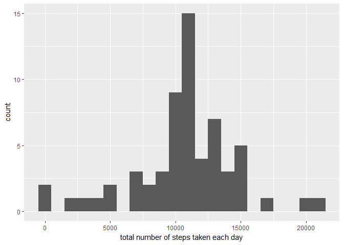

Libraries

```r
library(ggplot2)
```

## Loading and preprocessing the data


```r
if (!file.exists("activity.csv")) {
        unzip("activity.zip")
}

data <- read.csv("activity.csv")

data$date <- as.POSIXct(data$date, format = "%Y-%m-%d")
```

## What is mean total number of steps taken per day?

1. Total number of steps taken per day

```r
dailySteps <- tapply(data$steps, data$date, sum)
```

2. Histogram of steps per day

```r
qplot(dailySteps, binwdith = 1000, xlab = "Steps per day", ylab = "Frequency", main = "Histogram: Total Steps per day" )
```

<!-- -->

3. Mean and median values for total steps taken per day

```r
dailyStepsMean <- mean(dailySteps, na.rm=TRUE)
dailyStepsMedian <- median(dailySteps, na.rm=TRUE)
```

* Mean: 1.0766189\times 10^{4}
* Median:  10765

## What is the average daily activity pattern?


```r
intervalAggregate <- aggregate(list(data$steps), by = list(data$interval), FUN = mean, na.rm = TRUE)
colnames(intervalAggregate) <- c("interval", "steps")
```

1. Time series chart for average steps

```r
ggplot(data = intervalAggregate, aes(x = interval, y = steps)) +
        geom_line() +
        xlab("5 min intervals") +
        ylab("Mean steps")
```

<!-- -->

2. Interval with most steps on average

```r
maxInterval <- intervalAggregate[which.max(intervalAggregate$steps),]
```

* Maximum steps occur at: 835, 206.1698113 interval

## Imputing missing values

1. Total rows with NA's in the dataset (steps column)

```r
sumNA <- sum(is.na(data$steps))
```

2. Strategy to replace NA values in the dataset
The Na values will get replaced by the mean of steps at that interval

3. New dataset with imputed NAs

```r
imputeData <- data
for (i in 1:length(data$steps)) {
        if(is.na(imputeData$steps[i])) {
                NAinterval <- imputeData$interval[i]
                imputeData$steps[i] <- intervalAggregate[intervalAggregate$interval==NAinterval, 2]
        }
}
```

4. Histogram of the imputed dataset

```r
newDailySteps <- tapply(imputeData$steps, imputeData$date, sum)

qplot(newDailySteps, binwidth=1000, xlab="total number of steps taken each day")
```

<!-- -->

Mean and median

```r
newDailyStepsMean <- mean(newDailySteps)
newDailyStepsMedian <- median(newDailySteps)
```

* New mean: 1.0766189\times 10^{4}
* New median:  1.0766189\times 10^{4}

Effect of substituting NA's with mean

```r
par(mfcol=c(1,2))
hist(dailySteps, breaks=61, col="grey", main="Steps per day (with NA's)", xlab = "Steps")
hist(newDailySteps, breaks=61, col="grey", main="Steps per day (without NA's)", xlab = "Steps")
```

<!-- -->

## Are there differences in activity patterns between weekdays and weekends?

1. Adding a new factor variable in the dataset with two levels – “weekday” and “weekend” indicating whether a given date is a weekday or weekend day

```r
weekday <- NA
imputeData <- cbind(imputeData, weekday)
for (i in 1:length(imputeData$date)) {
        if(weekdays(imputeData$date[i]) == "Saturday" | weekdays(imputeData$date[i]) == "Sunday") {
                imputeData$weekday[i] <- "weekend"
        }
        else {
                imputeData$weekday[i] <- "weekday"
        }
}
imputeData$weekday <- as.factor(imputeData$weekday)
```

2. A time series plot of the 5-minute interval and the average number of steps taken, averaged across all weekday days.

```r
weeklyData <- aggregate(list(imputeData$steps), by=list(imputeData$weekday,imputeData$interval), FUN=mean)
colnames(weeklyData) <- c("weekday", "interval", "steps")

ggplot(data=weeklyData, aes(x=interval, y=steps)) +
        facet_grid(weekday~.) +
        geom_line() +
        xlab("5 min intervals") +
        ylab("Mean steps")
```

<!-- -->
